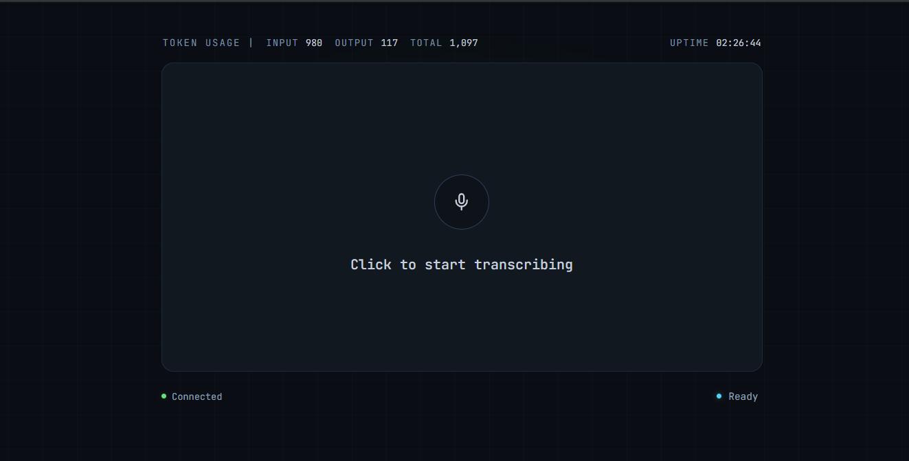
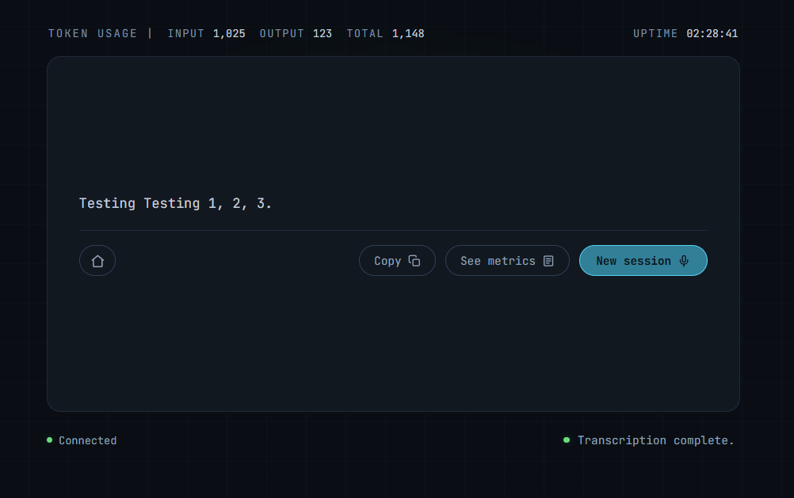

# assignment1-api



## Overview

This repository contains source code that implements a STT web interface that uses Open AI's gpt-4o-mini-transcribe model to produce transcriptions from audio file uploads.

Its core features include:
- Ability to record voice audio input from the web browser interface
- Display transcription output in the web interface
- Easily copy transcription output
- Observe request scope meta data regarding token usage, token consumption, response time, and recording size
- Provide global scope meta data about the total token usage since application launch across all users
- Observe application up-time since launch

## Getting Started

### Prerequisites

- **Java 25** (JDK). The build targets release 25.
- **Maven** — optional. The wrapper (`mvnw` / `mvnw.cmd`) is committed and needs no local install.
- A **web browser** with microphone support.
- **`OPENAI_API_KEY`** in the environment. Never committed; supplied at runtime only.

```bash
export OPENAI_API_KEY=sk-...          # Linux / macOS
$env:OPENAI_API_KEY = "sk-..."        # Windows PowerShell
```

With no key set the application still starts and serves the UI, wiring
`LocalStubTranscriptionService` in place of the real provider so it returns a stubbed
transcript.

### Running the application

Either route serves the UI on <http://localhost:8080>. Port 8080 is the value the YAML
spec declares; override it with `--server.port=<port>` locally or `-e SERVER_PORT=<port>`
in the container if it is already in use.

**Locally** — build the executable JAR, then run it:

```bash
./mvnw package                                 # mvnw.cmd package on Windows
java -jar target/assignment1-0.0.1-SNAPSHOT.jar
```

**In a container** — the image copies a JAR that is already built, so package first
either way:

```bash
./mvnw package
docker build -t assignment1-api .
docker run --rm -p 8080:8080 -e OPENAI_API_KEY <your_key>
```

`-e OPENAI_API_KEY` with no value forwards the key from the host environment, so the
credential stays out of the image.

### Running the tests

```bash
./mvnw test                                    # mvnw.cmd test on Windows
```

For more information on testing coverage see [`TESTING.md`](TESTING.md).

## API Endpoints

The springboot server exposes the following endpoints for application functionality:
- `POST /api/v1/transcribe` - Accepts a recording as multipart field `audio` and returns the transcript with its token usage.
- `GET /api/v1/admin/uptime` - How long the server has been running. Polled by the client to drive the connection handshake.
- `POST /api/v1/admin/shutdown` - Begins a graceful shutdown. The first caller gets `202` response, subsequent get `409`.
- `GET /api/v1/global/stats` - Total token usage across every transcription since launch.

A more detailed OpenAPI spec is defined in [`assignment1api.yaml`](assignment1api.yaml), which is the
authoritative reference for request and response schemas, status codes and examples. 

Every failure on every endpoint is rendered as the spec's `ErrorResponse` object — `timestamp`, `status`, `error`, `message`, `path`.

## Architecture

### Backend
- Spring Boot Java web server exposing the REST API
- Calls OpenAI's `/v1/audio/transcriptions` endpoint for STT
- `Assignment1ApiApplication.java` is the application entry point
- `assignment1/common` holds shared helpers, currently `ApiExceptionHandler` which renders every failure as the spec's `ErrorResponse`
- `assignment1/controller` defines the API endpoints, split logically into Admin, Stats and Transcription
- `assignment1/providers` holds the server's shared in-memory state eg. cumulative token counters, server start time, shutdown tracking
- `assignment1/responses` defines the records serialised to JSON as API responses
- `assignment1/services` defines the core business logic with the `TranscriptionService` interface and its implementations

### Frontend
- Static HTML, CSS and JavaScript, served by the same Spring Boot app from `src/main/resources/static`
- Uses the browser's built-in `MediaRecorder` API to capture audio
- Uses native `fetch()` to call the backend
- `index.html` is the single page site
- `css/styles.css` defines styling and layout
- `js/app.js` defines UI state and backend communication

### Request flow, end to end
1. Click the microphone button, granting the browser microphone permission on first use
2. `MediaRecorder` captures audio until the stop button is clicked
3. `app.js` uploads the recording to `/api/v1/transcribe` as multipart field `audio`
4. `TranscriptionController` validates the upload and passes the raw bytes and filename to its `TranscriptionService`
5. `OpenAiTranscriptionService`, or `LocalStubTranscriptionService` when no API key is set, builds the provider request and posts it to `/v1/audio/transcriptions`
6. The reply is mapped into the internal `TranscriptionResult` record and its token counts added to the global totals
7. The controller returns that record as JSON containing the transcript and its token usage
8. The UI renders the transcript, with options to copy it, view its metadata, or start a new session



## Design Decisions
- **Dependency injection** — controllers depend on the `TranscriptionService` interface rather than an implementation, so Spring wires the OpenAI service or local/test stub interchangeably
- **Centralised error handling** — one `@RestControllerAdvice` renders every failure as the spec's `ErrorResponse`, so no controller needs a try/catch
- **Records for the API contract** — immutable Java records define the JSON shape, keeping the provider's wire format out of our responses
- **Virtual threads enabled** — each request gets its own virtual thread, so hundreds of blocking STT calls run at once without a thread pool ceiling
- **Concurrency safety** — stateless controllers, all shared state held in two atomics (token counts, shutdown latch), `server.shutdown=graceful` to let in-flight work finish, and a request ceiling set by `max-connections` rather than a thread count
- **Credential handling** — the key is read from `OPENAI_API_KEY` environment at startup, it is never committed, logged, or returned in a response
- **Logging** — one INFO line per STT call (model, bytes, ms, token counts), the key, audio and transcript are never logged
- **Error handling** — the client maps each microphone and API failure to its own message, so every error state is distinct and informative
- **Client-side optimizations** — mono capture at a 24 kbps Opus bitrate, chunked recording, and polling paused while the tab is hidden. See [`TESTING.md`](TESTING.md) for performance results

## Troubleshooting
- **No key present** — the app still starts, wiring `LocalStubTranscriptionService` to return a canned transcript instead of calling OpenAI
- **Secure context required** — `getUserMedia` and the clipboard work only on `https://` or `localhost`, over plain HTTP recording and copying are disabled due to browser security
- **25 MB upload limit** — OpenAI's own cap, enforced client-side, by `spring.servlet.multipart.max-file-size` and again in the controller, so all three must agree
- **Configuration reference** — every config parameter (port, timeouts, upload limits, model, base URL) lives in `src/main/resources/application.properties`

## Extra

### Local Testing Alternative
To exercise the full request path without spending OpenAI credits, [whisper-cpp-adapter](https://github.com/scottmac-dev/whisper-cpp-adapter)
wraps whisper.cpp in a local Python endpoint matching the request and response shape this project
expects. Point the application at it in `application.properties`:

```properties
openai.base-url=http://localhost:8000/v1/audio/transcriptions
```

`OPENAI_API_KEY` still needs any non-empty value which will be ignored: a blank key wires `LocalStubTranscriptionService`
instead, so the adapter would never be called.

### Extension Questions
Answers to extension questions beyond project scope.

Q1: How would you modify the YAML API specification to allow statistics to be gathered for different users?

Add a session-scoped path, `/api/v1/session/stats`, reusing the existing `GlobalStatsResponse` schema, and leave `/api/v1/global/stats` as the true global total. The session cookie from Q2 would be declared in the YAML as a `securityScheme` of `type: apiKey, in: cookie`, with `Set-Cookie` documented under the page response's `headers`. In the backend, `TokenCounterProvider` holds a `ConcurrentHashMap<UUID, Counts>`. Atomic updates are still required, since one session can have several tabs uploading at once. This strategy also needs a TTL or eviction policy for expired/stale sessions.

Q2: How could you distinguish between different users accessing the web page?

A simple solution could be session cookies. On the first request to `GET /index.html` the server responds with `Set-Cookie: session_id=<uuid>; HttpOnly; SameSite=Strict; Path=/`, and the browser attaches `Cookie: session_id=<uuid>` to every later request for the backend to read. Spring Boot provides this out of the box through `HttpSession` and its `JSESSIONID`, and because the frontend is served from the same origin, `fetch()` sends the cookie automatically. It identifies a browser session rather than a person, and the value can be forged so its not a secure solution. It may be suitable for token statistics but not authentication.

Q3: What is bad about exposing /api/v1/admin/shutdown and can you think of a safer way to implement this functionality in a cloud environment?

Ideally a production deployment would not publicly expose a shutdown endpoint on the public internet and would handle shutdown via some sort of control-plane infrastructure which provides privileged admin access with appropriate permissions and authentication. In this case authenticated users would interact directly with the deploy system (systemd, docker, kubernetes, xyz cloud dashboard) issuing the command to the machine itself instead a exposed API endpoint.

If a shutdown endpoint is required, some more secure alternatives could be:
- Using strong authentication on shutdown route (Admin API keys)
- Using a firewall or VPN which only permits access to that endpoint from trusted client, eg an AllowList
